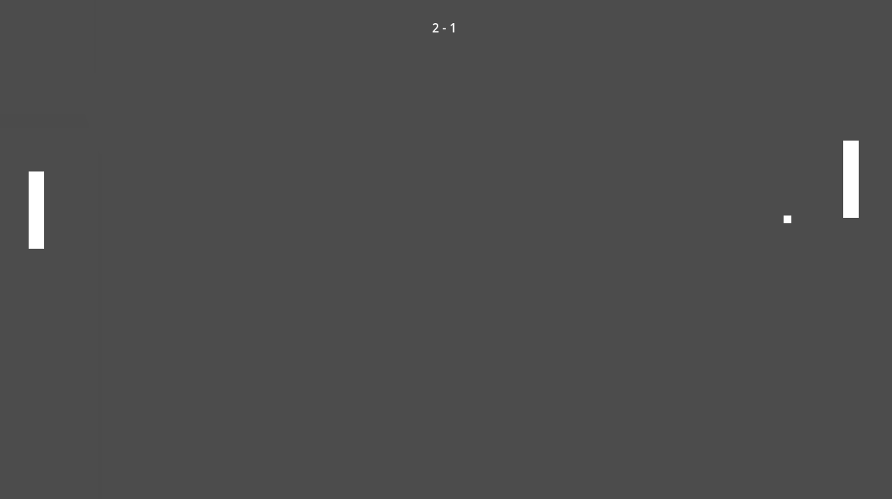

# Pong
## Summary

The classic Pong game, a two-dimensional sports game that simulates table tennis.

## How to play!

The left paddle can be moved with the keys <kbd>W</kbd>, <kbd>A</kbd>, <kbd>S</kbd> and <kbd>D</kbd>.

The right paddle is controled by IA (call that IA is maybe to much, but you know what I mean).
